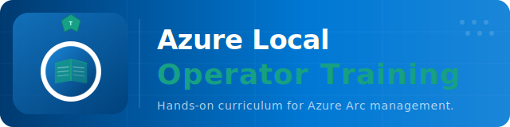

# azurelocal-training



[](https://azurelocal.cloud)

Documentation: [azurelocal.cloud](https://azurelocal.cloud) | Solutions: [Azure Local Solutions](https://azurelocal.cloud)

Training materials and guides for **Azure Local** (formerly Azure Stack HCI).

---

## Documentation

The documentation site is built with [MkDocs Material](https://squidfunk.github.io/mkdocs-material/) and published to GitHub Pages.

**Site URL**: https://azurelocal.github.io/azurelocal-training/

---

## Local Development

```bash
pip install mkdocs-material
mkdocs serve
```

---

## Contributing

See [CONTRIBUTING.md](CONTRIBUTING.md).
